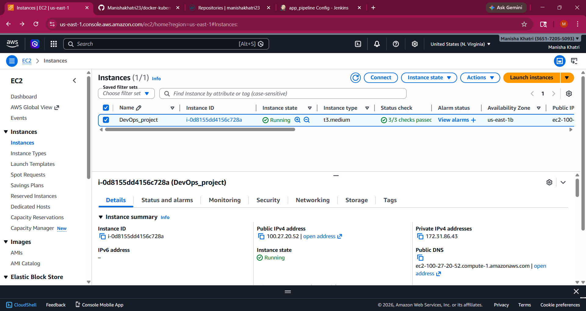
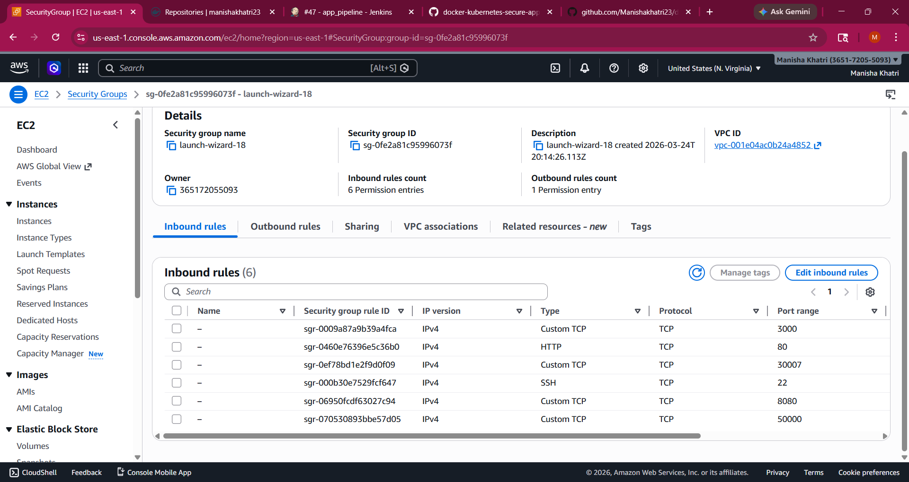
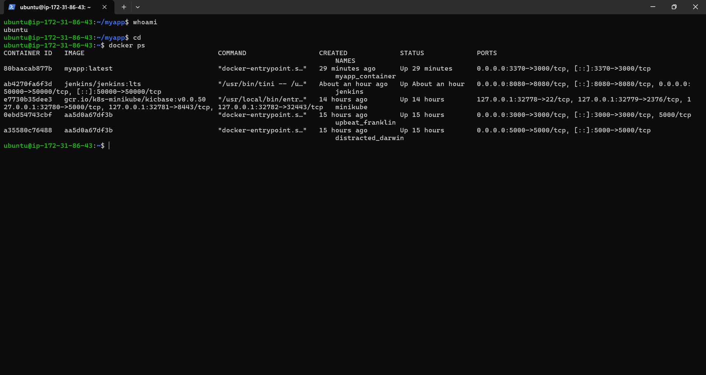
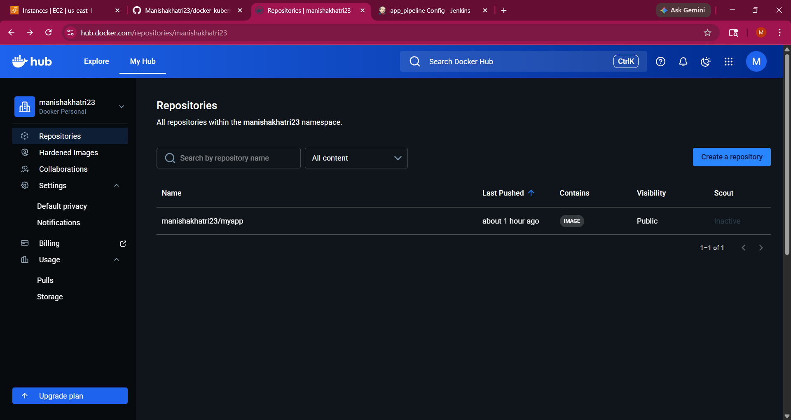
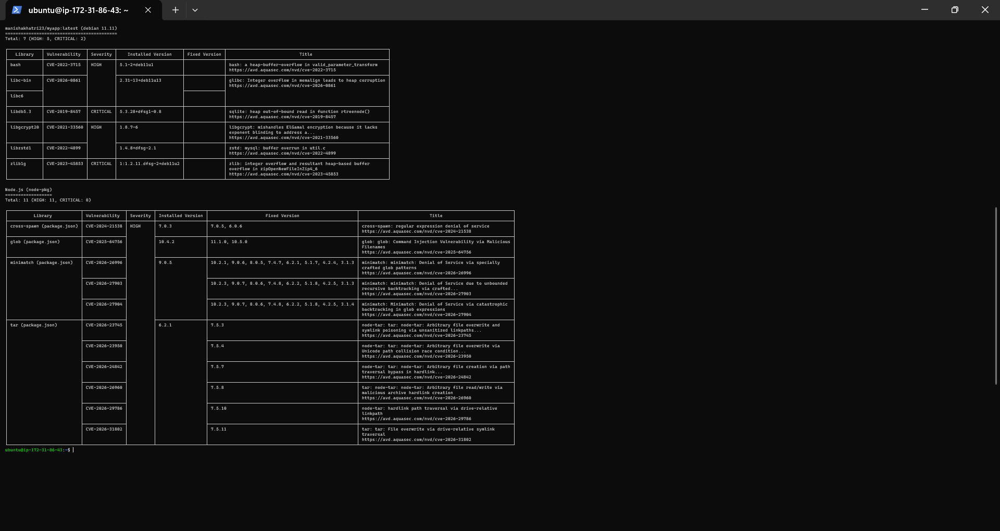
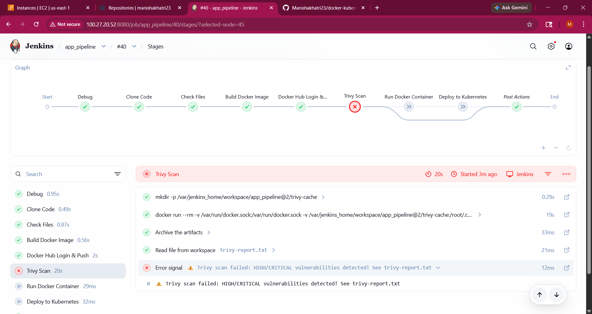
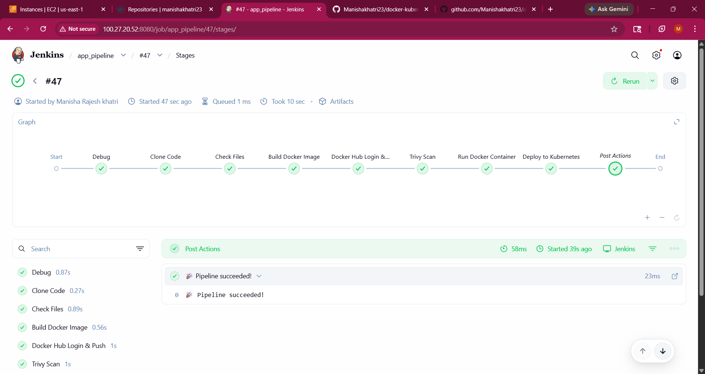
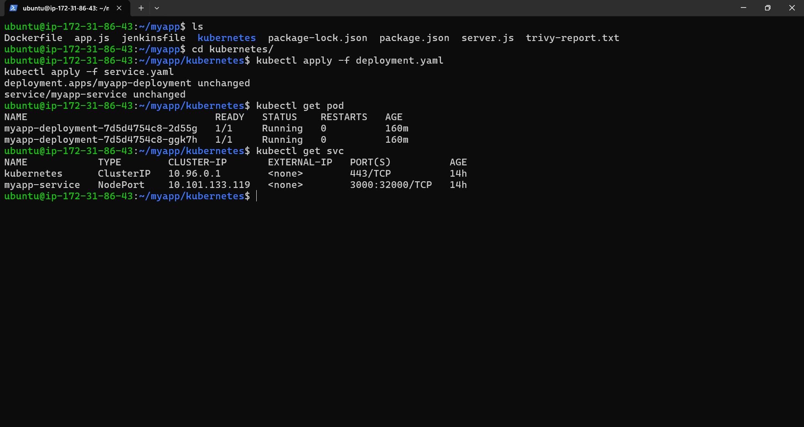

# 🚀 CI/CD Pipeline with Docker Security Scanning & Kubernetes Deployment

## 📌 Project Overview

This project presents the design and implementation of a secure CI/CD pipeline that automates the process of building, scanning, and deploying applications using modern DevOps tools. The pipeline integrates Jenkins for continuous integration, Docker for containerization, and Kubernetes for deployment. The entire workflow ensures that application updates are efficiently processed from code commit to production deployment with minimal manual intervention.

A key highlight of this project is the integration of security within the pipeline using Trivy. Before deployment, Docker images are scanned for vulnerabilities, and the pipeline is configured to fail automatically if any HIGH or CRITICAL issues are detected. This approach enforces secure DevOps practices by preventing insecure applications from being deployed, ensuring reliability, scalability, and security in the deployment lifecycle.

---

## 🎯 Objectives
- Automate build and deployment process
- Scan Docker images for vulnerabilities
- Fail pipeline if HIGH/CRITICAL issues found
- Deploy only secure images to Kubernetes

---

## 🏗️ Architecture_Overview

```bash

        +-------------------+
        │    Developer      │
        │   Code Commit     │
        +-------------------+
                  │
                  v
        +-------------------+
        │      GitHub       │
        │   Source Code     │
        +-------------------+
                  │
                  v
        +------------------------+
        │       Jenkins          │
        │     CI/CD Pipeline     │
        +------------------------+
                  │
                  v
        +------------------------+
        │     Docker Build       │
        │   Create Image         │
        +------------------------+
                  │
                  v
        +------------------------+
        │     Trivy Scanner      │
        │  Vulnerability Check   │
        +------------------------+
                  │
                  v
             +-----------+
             │ Decision  │
             │ Secure?   │
             +-----------+
             /         \
            /           \
           v             v
   +---------------+   +------------------------+
   │ Pipeline Fail │   │    Push to Registry    │
   │ ❌ Stop Build │   │      (Docker Hub)      │
   +---------------+   +------------------------+
                               │
                               v
                    +-------------------------+
                    │ Kubernetes Cluster      │
                    │ Deployment + Pods       │
                    +-------------------------+
                               │
                               v
                    +-------------------------+
                    │ Service (NodePort)      │
                    +-------------------------+
                               │
                               v
                    +-------------------------+
                    │ End User (Browser)      │
                    +-------------------------+

```

---

## 🛠️ Technologies Used
- Docker
- Jenkins
- Kubernetes
- Trivy
- GitHub

---

## 🔄 CI/CD Pipeline Stages

### 1. Source Code (GitHub)
- Application code stored in GitHub repository

### 2. Build Stage (Docker)
- Docker image created using Dockerfile

### 3. Security Scan (Trivy)
- Image scanned for vulnerabilities
- HIGH/CRITICAL issues detected

### 4. Deployment (Kubernetes)
- Deployment and Service created
- Application exposed via NodePort

---

## ☁️ AWS EC2 Setup

### 🔹 Launch EC2 Instance

- Go to AWS Console  
- Open EC2 Dashboard  
- Click **Launch Instance**  
- Choose **Ubuntu**  
- Instance type → t3.medium  
- Create / select key pair  
- Allow ports:
  - 22 (SSH)
  - 8080 (Jenkins)
  - 30007 (Kubernetes node port)
  - 80 (Web access)
  - 3000 (Application)
  - 50000 (Jenkins internal communication)


### 🔹 Connect to EC2

```bash
ssh -i your-key.pem ubuntu@your-ec2-public-ip
```
---

## 🧰 Installation & Setup

### 1. 🐳 Install Docker

```bash
sudo apt update
sudo apt install docker.io -y
sudo systemctl start docker
sudo systemctl enable docker
```
Check:

```bash
docker --version
```
---

### 2. 🤖 Install Jenkins

```bash
sudo apt update
sudo apt install openjdk-17-jdk -y
java --version

sudo docker pull jenkins/jenkins:lts
13 sudo docker run -d -p 8080:8080 -p 50000:50000 --name jenkins jenkins/jenkins:lts

sudo apt update
sudo systemctl enable jenkins
```
Check:

```bash
systemctl status jenkins
```
---

### 3. 🔐 Install Trivy
```bash
sudo apt install wget apt-transport-https gnupg lsb-release -y

wget -qO - https://aquasecurity.github.io/trivy-repo/deb/public.key | sudo apt-key add -

echo deb https://aquasecurity.github.io/trivy-repo/deb $(lsb_release -sc) main | \
sudo tee /etc/apt/sources.list.d/trivy.list

sudo apt update
sudo apt install trivy -y
```

Check:
```bash
trivy --version
```

---

### 4. ☸️ Install Kubernetes (kubectl)

```bash
sudo apt install -y kubectl
```

Check:

```bash
kubectl version --client
```
---

### 5. 🧪 Install Minikube 
```bash
curl -LO https://storage.googleapis.com/minikube/releases/latest/minikube-linux-amd64
sudo install minikube-linux-amd64 /usr/local/bin/minikube

minikube start
```

Check:
```bash
minikube version
```
--- 


## 📁 Project Structure

```bash 

DevOps-project-CI-CD/
│
├── myapp/
│   ├── Dockerfile
│   │── app.js
│   ├── jenkinsfile
│   ├── package-lock.json
│   ├── package.json (Node.js app)
│   ├── server.js 
│   ├── trivy-report.txt
│   ├── kubernetes/
│       ├── deployment.yaml
│       └── service.yaml
│
├── Screenshots
│   ├── Architecture_diagram.png
│
├── Screenshots
│   ├── Docker_container_status.png
│   ├── EC2_Instance_running.png
│   ├── Dockerhub_image_pushed.png
│   ├── Pipeline_Success.png
│   ├── Pipeline failed.png
│   ├── Kubernetes_pods_and_service.png
│   ├── Security_group_add.png
│   └── Trivy_report_detail.png
│
├── README.md

```

---

## 📦 Docker Setup

### 🔹 Login to Docker Hub
```bash
docker login
```

### 🔹 Build Docker Image
```bash
docker build -t myapp:latest .
```

### 🔹 Tag Image
```bash
docker tag myapp:latest your-dockerhub-username/myapp:latest
```

### 🔹 Push Image
```bash
docker push your-dockerhub-username/myapp:latest
```
### 🔹 Verify Image
Go to Docker Hub
Check your repository
Image should be visible

---

## 🔍 Trivy Security Scan
### 🔹 Scan Docker Image
```bash
trivy image your-dockerhub-username/myapp:latest
```

### 🔹 Save Scan Report(text)
```bash
trivy image -f table -o trivy-report.txt your-dockerhub-username/myapp:latest
```

### 🔹 Save Scan Report(JSON)
```bash
trivy image -f json -o trivy-report.json your-dockerhub-username/myapp:latest
```

---

## ☸️ Kubernetes Deployment

### 🔹 Apply Kubernetes
```bash
kubectl apply -f deployment.yaml
kubectl apply -f service.yaml
```

Check Running Pods and Services:
```bash
kubectl get pods
kubectl get svc
```

### 🔹 Access Application
```bash
http://<node-ip>:30007
```
---

## 🤖 Jenkins Pipeline

### 🔹 Jenkins open

http://localhost:8080

### 🔹 Pipeline Stages
- Clone Code  
- Build Docker Image  
- Scan using Trivy  
- Deploy to Kubernetes 

### 🔹 Pipeline Flow

Create Pipeline Job → Add Script → Build Now → Monitor Console

### 🔹 Pipeline Result:
Code → Docker Build → Trivy Scan → 
   ❌ Fail → Stop
   ✅ Pass → Kubernetes Deploy → Browser Output


---

## 🔐 Security Implementation

- Trivy used for vulnerability scanning  
- Pipeline fails if HIGH/CRITICAL issues found  
- Prevents insecure deployments  

---


## 📸 Output Screenshots
### ☁️ EC2 Instance Running


### Security Group Configuration


### Docker Container Running


###  Dockerhub Image


### Trivy_report


### ❌ Pipeline Failure (Trivy)


### ✅ Jenkins Pipeline Success


### Kubernetes Deployment



---


## 📊 Key Learnings
- CI/CD pipeline automation
- Docker containerization
- Security scanning using Trivy
- Kubernetes deployment
- DevOps best practices

---

## 📌 Conclusion

This project successfully implements a secure CI/CD pipeline where vulnerable images are blocked and only secure applications are deployed, ensuring reliability and security in the deployment process.


---

## 👩‍💻 Author

**Manisha Khatri**

🔗 GitHub: https://github.com/Manishakhatri23
